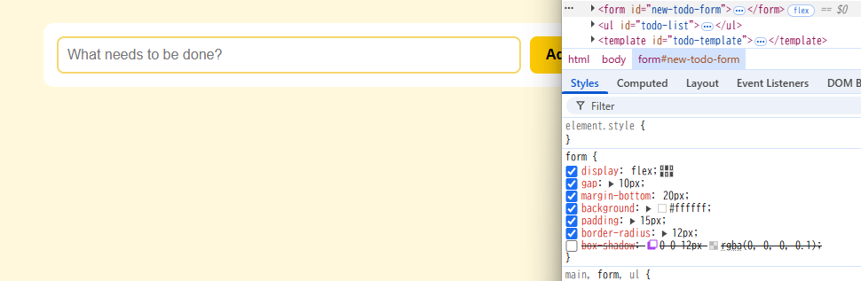
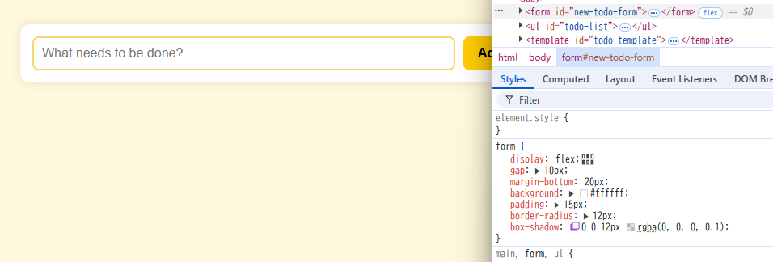

# 解答

## 15.4-10.1 および 15.4-10.2 の ToDo アプリに対してブラウザの開発者ツールから値の変更やプロパティの追加を試してみなさい

- 操作手順

開発者ツールの起動：Chromeの場合、F12キーまたはCtrl + Shift + I（Windows/Linux）またはCmd + Option + I（Mac）を押すことで開発者ツールを開きます。

要素の選択：「Elements」タブを選択し、ページ上で変更したい要素を右クリックして「検証」を選択します。

CSSの編集：右側の「Styles」ペインで、既存のCSSプロパティを編集したり、新しいプロパティを追加したりできます。

変更の確認：編集した内容は即座にページに反映されます。変更内容はブラウザをリロードすると元に戻ります。

## 開発者ツールで CSS に関して実行できる操作を検索エンジンで調べ、便利だと思ったものを 3 つ挙げなさい

1. CSSレイヤーの表示
複数にCSSファイルが適用されている場合、各プロパティがどのレイヤーから来ているのかを確認できる。これにより、スタイルの優先順位や競合を把握しやすくなる

2. セレクタの特異性の確認
「Computed」タブで、各プロパティがどのセレクタによって適用されているかを確認できる。これにより、意図しないスタイルの上書きや競合を特定できる。

3. CSSプロパティの説明の表示
プロパティ名にカーソルを合わせると、そのプロパティの説明やMDNのリンクが表示される。これにより、プロパティの意味や使い方をすばやく確認できる。

## 15.4-10.2 のアプリの body 要素に対し、元々 HTML および JS 内で利用していなかった Tailwind CSS のクラス (bg-rose-600 など何でも良い) を開発者ツールから追加すると変更が反映されないが、これは何故か調べなさい

Tailwind CSSは、私用されていないクラスをビルド時に削除する「JIT(Just-In-Time)モード」を採用されている。このため、HTMLやJS内で使用されていないクラスは、開発者ツールで直接追加しても反映されない。
