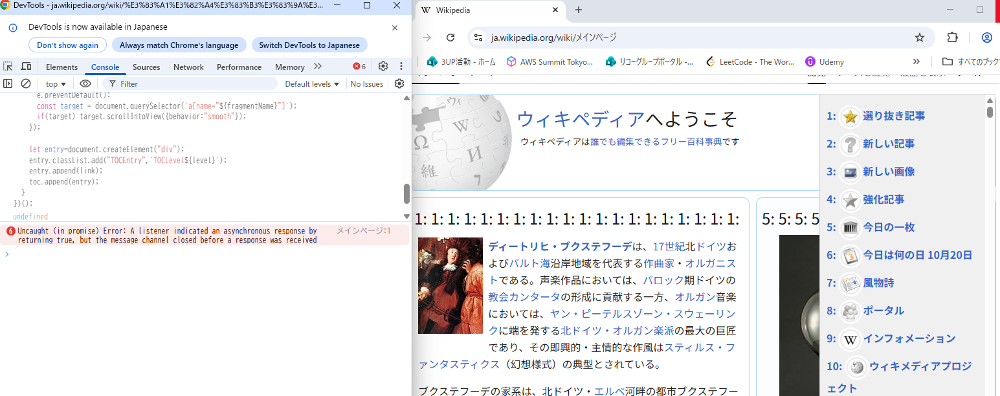

# 解答

## 適当な Web サイトを開き、ブラウザの開発者ツールに TOC.js の内容を貼り付けて実行してみなさい

## TOC.js をブックマークレットにして簡単に実行できるようにしなさい (javascript:{TOC.js のコード} というブックマークを作成)

Console に貼り付けると、目次リンクをクリックしたときにページ内でスムーズスクロールする

## 下記の例を参考にして目次を選択した時にスムーズに遷移するようにしなさい

- 上のコードを 1行にまとめる
- 先頭に javascript: をつける
- ブラウザのブックマークバーにドラッグして登録

## 

- ブックマークを作る

Chrome/Edgeの場合：
ブラウザ右上の「☆」アイコン（ブックマーク作成）をクリック。
名前を入力。
URL欄にindex2.jsを貼り付ける。
保存。

- 使い方

目次を作りたいページを開く。
作ったブックマークレットをクリック。
ページ内の h1, h2, h3 から目次が自動生成され、ページ上部に表示される。
