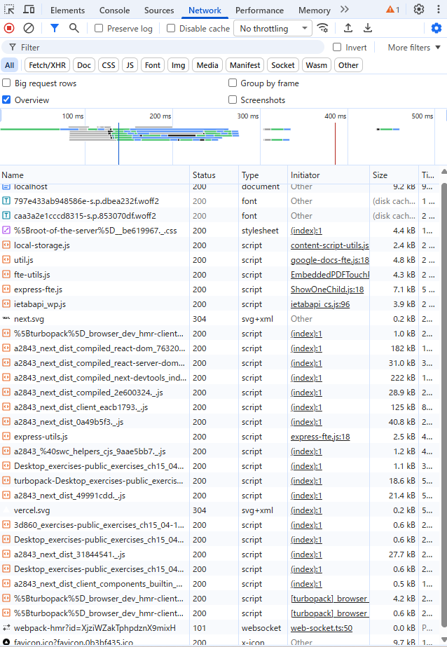

# 解答

1. 以下の動作を確認しなさい

    - ブラウザの開発者ツールの「ネットワーク」タブを確認してみよう。リンクをクリックしたときに通信は発生しているだろうか？

    A. していない

    - pushState はいつ実行されているだろうか？

    A.

    - リロード時に画面の表示はどうなるだろうか？

    A.

2. 1 で確認した動作と 15.4-10.12 で確認した動作を比較し、next.js の Link でどういった処理が行われているかをまとめなさい。
