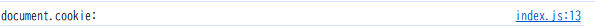
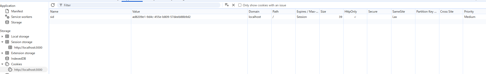
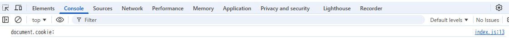
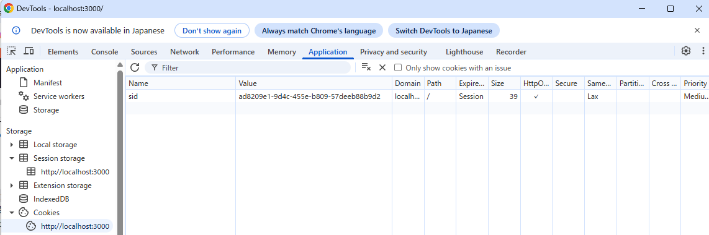

# 解答

## index.js でdocument.cookie プロパティを console.logで表示する

document.cookie:

CookieはHttpOnly属性がついているため、JavaScriptからCookieを読み取ることができず、document.cookieに表示されない
HttpOnlyは、JavaScriptからのアクセスを禁止するもの

## ブラウザの開発者コンソールで http://localhost:3000/ の Cookie を表示する

sid：ad8209e1-9d4c-455e-b809-57deeb88b9d2

## ToDo アプリのタブをリロードする

- document.cookie

document.cookie:

- sid:

sid：ad8209e1-9d4c-455e-b809-57deeb88b9d2

- リロードしてもどちらも変わらない → サーバーは同じsidに紐づくタスク一覧を返す

## 同一ブラウザの異なるタブやウィンドウで http://localhost:3000/ を開いて ToDo リストの状態を確認する

同じ状態の画面が開く

理由：ブラウザは同一サイト（localhost:3000）へ同じCookieを送信するため同じセッションが共有されるから

## シークレットウィンドウや異なるブラウザで http://localhost:3000/ を開いて ToDo リストの状態を確認する

空のToDoリストが表示される

理由：シークレットウィンドウはCookieを共有しないため、サーバは新しいsidを発行し、独立したタスクリストを管理する

## http://127.0.0.1:3000/ を開いて ToDo リストの状態を確認する

空のToDoリストが表示される

理由：127.0.0.1とlocalhostはホスト名が違うため別オリジンのため、同じCookieは送信されない。サーバーは新しいsidを発行し、別のタスクリストを用意する
