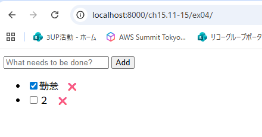
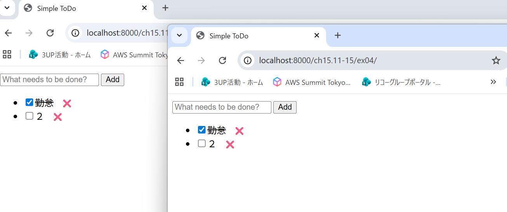
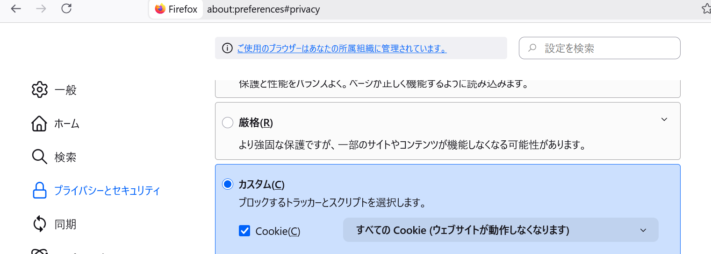
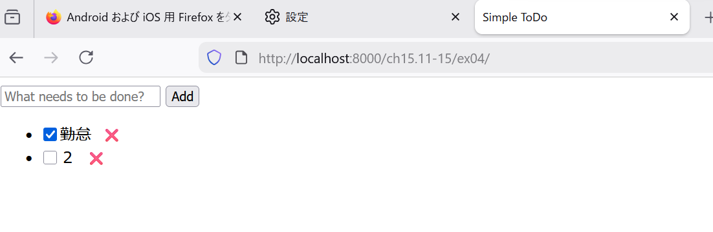

# 解答

## ToDo のリストを localStorage に保存し、一度閉じて再度開いても、画面更新しても、ToDo の内容が維持されるようにしなさい。

## 複数のタブで ToDo 管理アプリケーションを開いている状態で、あるタブでの変更が他のタブにも自動的に反映されるようにしなさい。

## ブラウザの設定で、localStorage の利用を禁止にしてもエラーが発生せず、そのタブを開いている間だけは正常に動くようにしなさい。

