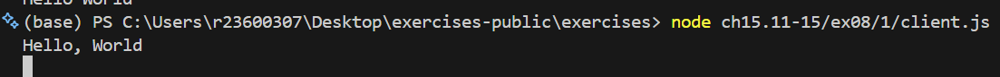
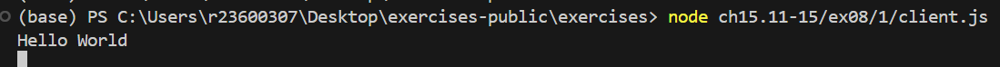

# 結果

## 実行手順

server > responder > client

## 1

WebSocket server started on ws://localhost:3003
{"id":"77db2c97-e006-49ee-8b4d-037aa0308e4d","request":"World"} wait 3351ms
{"id":"77db2c97-e006-49ee-8b4d-037aa0308e4d","response":"Hello, World"} wait 227ms

## 2

WebSocket server started on ws://localhost:3003
{"id":"e8a1ee0a-d976-47d3-a5a4-8355a56b3f96","request":"World"} wait 3825ms
{"id":"e8a1ee0a-d976-47d3-a5a4-8355a56b3f96","response":"Hello World"} wait 4417ms

Responder connected
Responded: {"id":"e8a1ee0a-d976-47d3-a5a4-8355a56b3f96","response":"Hello World"}

