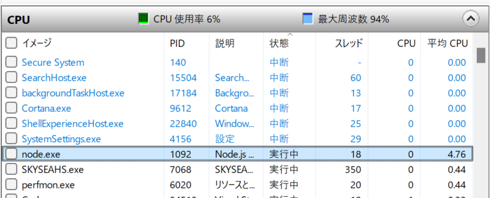
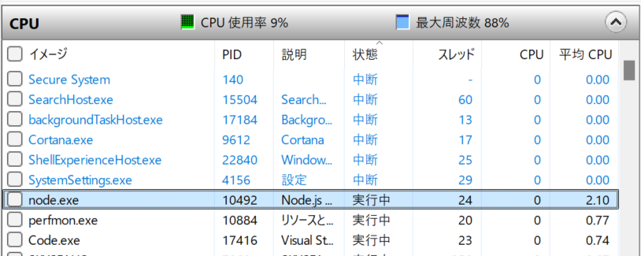
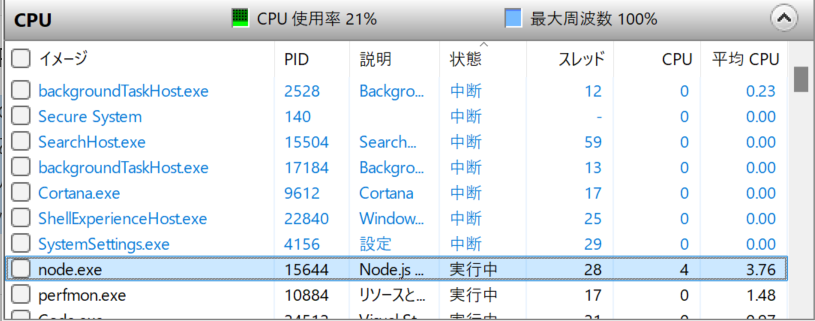

# 解答

## マルチスレッドとは？

マルチスレッドとは、1つのプログラム内で複数の処理を同時に実行する仕組み。
JavaScriptは基本的にシングルスレッドで動作するが、非同期処理やイベントループによって同時に処理しているように見える。
また、Web WorkersやWorker Threadsを利用することで、JavaScriptでもマルチスレッド処理を実現できる。

## > node mFib.js 45 1の結果

### mFib.jsの実行結果

Worker 0 execution time: 24.061s
Total execution time: 24.080s
Fibonacci number: 1836311902

### リソースモニターの結果

スレッドの数は14

## > node mFib.js 45 2の結果

### mFib.jsの実行結果

Worker 0 execution time: 7.517s
Worker 1 execution time: 13.620s
Total execution time: 13.629s
Fibonacci number: 1836311902

### リソースモニターの結果

スレッド数は18

## > node mFib.js 45 4の結果

### mFib.jsの実行結果

Worker 0 execution time: 2.635s
Worker 2 execution time: 3.976s
Worker 3 execution time: 5.914s
Worker 1 execution time: 8.713s
Total execution time: 8.723s
Fibonacci number: 1836311902

### リソースモニターの結果

スレッド数は20

## > node mFib.js 45 8の結果

### mFib.jsの実行結果

Worker 5 execution time: 1.031s
Worker 2 execution time: 1.592s
Worker 6 execution time: 2.372s
Worker 0 execution time: 3.498s
Worker 7 execution time: 5.493s
Worker 1 execution time: 7.831s
Total execution time: 7.837s
Fibonacci number: 1836311902

### リソースモニターの結果

スレッド数は24

## > node mFib.js 45 12の結果

### mFib.jsの実行結果

Worker 1 execution time: 222.708ms
Worker 5 execution time: 231.808ms
Worker 2 execution time: 275.399ms
Worker 0 execution time: 413.675ms
Worker 7 execution time: 496.035ms
Worker 3 execution time: 752.976ms
Worker 8 execution time: 1.173s
Worker 11 execution time: 1.674s
Worker 6 execution time: 2.606s
Worker 4 execution time: 3.814s
Worker 9 execution time: 5.885s
Worker 10 execution time: 11.013s
Total execution time: 11.038s
Fibonacci number: 1836311902

### リソースモニターの結果

スレッド数は28

## 実行時間の推移

| 指定スレッド数 | 実行時間 |
|---|---|
| 1 | 約24.1s |
| 2 | 約13.6s |
| 4 | 約8.7s |
| 8 | 約7.8s |
| 12 | 約11.0s |

## OS上のスレッド数

| 指定スレッド数 | リソースモニター上のスレッド数 |
|---|---|
| 1 | 14 |
| 2 | 18 |
| 4 | 20 |
| 8 | 24 |
| 12 | 28 |

## 考察

Windowsのリソースモニターを用いて node.exe のスレッド数を確認したところ、mFib.js で指定したスレッド数よりも多いスレッドが生成されていることを確認した。
これは、Worker Threads に加えて、Node.js のメインスレッドや内部処理用スレッドが存在するためである。
また、スレッド数を増やすことで実行時間は短縮されたが、CPUの論理コア数を超えると改善効果は小さくなった。
