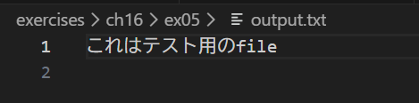

# 解答

## 標準入力

プログラムが外部から入力を受け取るための入り口で、通常はキーボード。
Node.jsではprocess.stdin

例(FODが標準入力として渡される)：

```bash
echo FOO | node cat.mjs
```

## 標準出力

プログラムが通常の結果を出力する先のことで、通常はコンソールのこと。
Node.jsではprocess.stdout

例：

```js
console.log("Hello");
```

## 標準エラー出力

エラーメッセージ専用の出力先で、通常はコンソールだが、stdoutとは別。
Node.jsではprocess.stderr

例：

```js
console.error("エラーです");
```

## リダイレクト

標準入力・出力の向き先を変更する仕組みで、シェルの機能

| 記号 | 意味 |
| --- | --- |
| > | 標準出力をファイルへ |
| < | ファイルを標準入力へ |
| 2> | 標準エラー出力をファイルへ |

例：

```bash
node cat.mjs > output.txt
```

## パイプ

あるコマンドの標準出力を、別のコマンドの標準入力につなぐ。記号は|

例：

```bash
echo FOO | node cat.mjs
```

## 実験の予測と結果

- node cat.mjs

予想：出力なし
結果：

```bash
> node cat.mjs
Warning: Ignoring extra certs from `C:\ZCC\ZscalerRootCertificate-2048-SHA256.crt`, load failed: error:80000002:system library::No such file or directory
```

- echo FOO | node cat.mjs

予想：FOOと出力される
結果：

```bash
> echo FOO | node cat.mjs
Warning: Ignoring extra certs from `C:\ZCC\ZscalerRootCertificate-2048-SHA256.crt`, load failed: error:80000002:system library::No such file or directory
FOO
```

- node cat.mjs > output.txt

予想：何も起きない
結果：

```bash
> node cat.mjs > output.txt
Warning: Ignoring extra certs from `C:\ZCC\ZscalerRootCertificate-2048-SHA256.crt`, load failed: error:80000002:system library::No such file or directory

```

→ output.txtにも何も出力されない

- node cat.mjs file

予想：fileの中身が出力される
結果：

```bash
> node cat.mjs file
Warning: Ignoring extra certs from `C:\ZCC\ZscalerRootCertificate-2048-SHA256.crt`, load failed: error:80000002:system library::No such file or directory
これはテスト用のfile
```

- node cat.mjs file > output.txt

予想：fileの中身がoutput.txtに出力される
結果：

```bash
> node cat.mjs file > output.txt
Warning: Ignoring extra certs from `C:\ZCC\ZscalerRootCertificate-2048-SHA256.crt`, load failed: error:80000002:system library::No such file or directory
```

コマンドには何も出力されず、fileの中身がoutput.txtに出力される


- node cat.mjs invalid-file > output.txt

予想：エラーが出力される
結果：

```bash
> node cat.mjs invalid-file > output.txt
Warning: Ignoring extra certs from `C:\ZCC\ZscalerRootCertificate-2048-SHA256.crt`, load failed: error:80000002:system library::No such file or directory
node:events:496
      throw er; // Unhandled 'error' event
      ^

Error: ENOENT: no such file or directory, open 'C:\Users\r23600307\Desktop\exercises-public\exercises\ch16\ex05\invalid-file'
Emitted 'error' event on ReadStream instance at:
    at emitErrorNT (node:internal/streams/destroy:169:8)
    at emitErrorCloseNT (node:internal/streams/destroy:128:3)
    at process.processTicksAndRejections (node:internal/process/task_queues:82:21) {
  errno: -4058,
  code: 'ENOENT',
  syscall: 'open',
  path: 'C:\\Users\\r23600307\\Desktop\\exercises-public\\exercises\\ch16\\ex05\\invalid-file'
}

Node.js v20.12.1
```

- node cat.mjs invalid-file 2> error.txt

予想：エラーがerror.txtに出力される
結果：

```bash
> node cat.mjs invalid-file > output.txt
Warning: Ignoring extra certs from `C:\ZCC\ZscalerRootCertificate-2048-SHA256.crt`, load failed: error:80000002:system library::No such file or directory
node:events:496
      throw er; // Unhandled 'error' event
      ^

Error: ENOENT: no such file or directory, open 'C:\Users\r23600307\Desktop\exercises-public\exercises\ch16\ex05\invalid-file'
Emitted 'error' event on ReadStream instance at:
    at emitErrorNT (node:internal/streams/destroy:169:8)
    at emitErrorCloseNT (node:internal/streams/destroy:128:3)
    at process.processTicksAndRejections (node:internal/process/task_queues:82:21) {
  errno: -4058,
  code: 'ENOENT',
  syscall: 'open',
  path: 'C:\\Users\\r23600307\\Desktop\\exercises-public\\exercises\\ch16\\ex05\\invalid-file'
}

Node.js v20.12.1
```

→ invalid-fileがないというエラーが出力され、error.txtは作成されない
