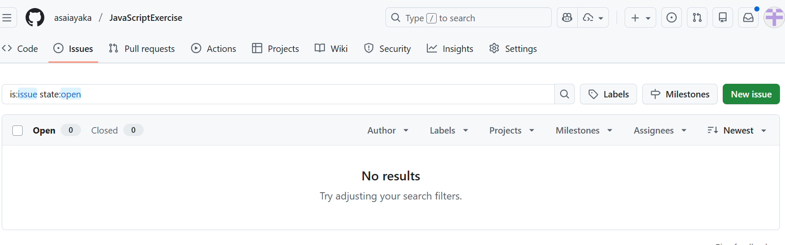

# 解答

まずGITHUB_TOKENを指定
> $Env:GITHUB_TOKEN=""

実行
> node index.js list <owner> <repo>

結果

> node index.js -v list asaiayaka JavaScriptExercise
Warning: Ignoring extra certs from `C:\ZCC\ZscalerRootCertificate-2048-SHA256.crt`, load failed: error:80000002:system library::No such file or directory
HTTP: GET https://api.github.com/repos/asaiayaka/JavaScriptExercise/issues?state=open
STATUS: 200
RESPONSE: []
