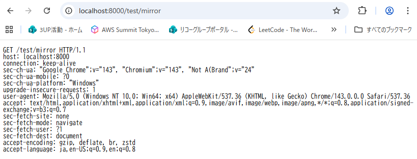

# 結果

> node server.js ./public 8000
Warning: Ignoring extra certs from `C:\ZCC\ZscalerRootCertificate-2048-SHA256.crt`, load failed: error:80000002:system library::No such file or directory
Listening on port 8000
Serving directory: ./public

