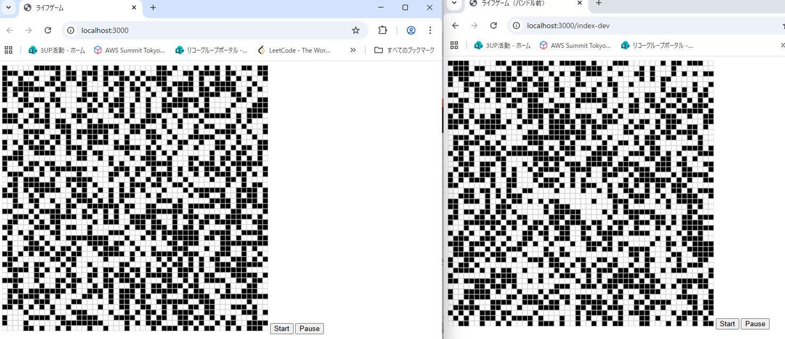
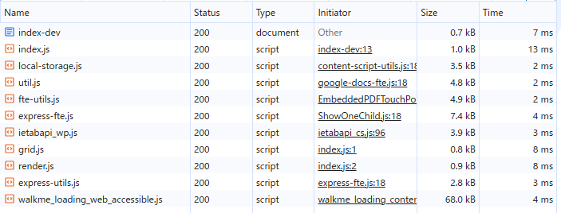
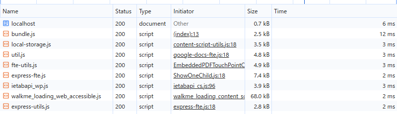

# 解答

## バンドルしたコードと元のコードを比較し、どのような処理が行われたかを確認しなさい

バンドル前はindex.jsからgrid.js、render.jsをimportしており、ブラウザは複数のJavaScriptファイルを個別にダウンロードしていた。
一報、バンドル後はwebpackによりそれらがbundle.jsにまとめられ、ブラウザがダウンロードするJavaScriptファイルは1つになった。

## バンドル前後それぞれのコードを利用するページをローカルサーバで配信してブラウザから閲覧できるようにしなさい。

## 開発者ツールで ネットワーク タブを開き、スクリプトのダウンロード時間、ページの読み込み完了時間について比較しなさい。

バンドル前：
バンドル後：

バンドル前：
index.js: 13ms
grid.js: 8ms
render.js: 8ms
合計：29ms

バンドル後：
bundle.js: 12ms
合計：12ms

Networkタブを確認したところ、バンドル前は3つの JavaScript ファイルを合計29msでダウンロードしていたが、
バンドル後は bundle.js 1ファイルのみとなり、12msで完了していた。
このことから、HTTP リクエスト数削減により読み込みが効率化されたことが確認できた。
