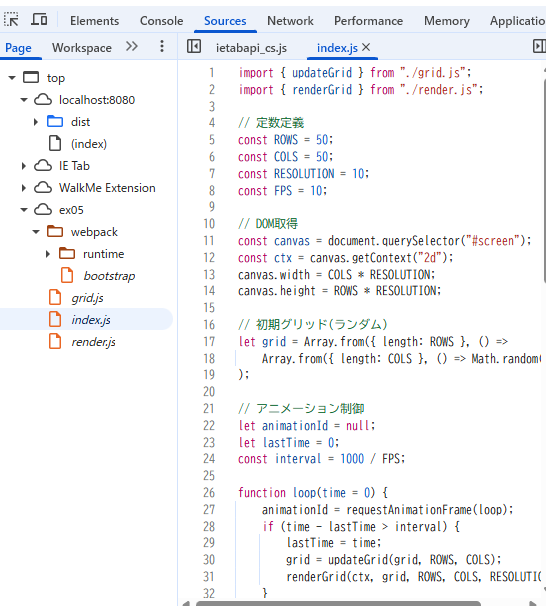
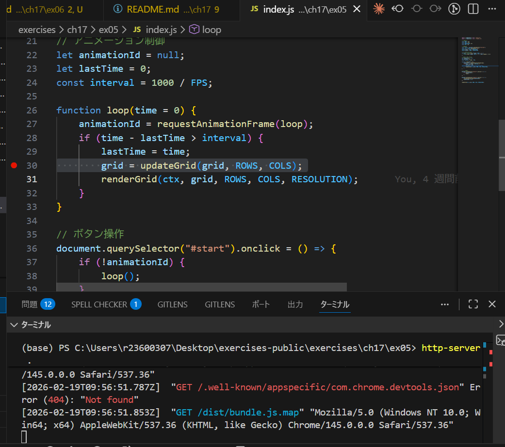

# 解答

## webpack の設定でバンドル時にソースマップを生成するようにしなさい

webpack.config.js で以下を指定

```
devtool: "source-map"
```

バンドルを作成
ターミナルで以下を実行（ch17/ex05 ディレクトリで）：

```
npx webpack --config webpack.config.js
```

ローカルサーバー立ち上げ

npm install -g http-server
http-server .

index.js


ブレイクポイントを貼っても変わらない（張る場所が違う？）


